# bucketd

Distributed rate limiter in Go. Token bucket + sliding window algorithms, Redis Lua atomic scripts, consistent-hashing client library for multi-node sharding, gRPC + HTTP APIs, Prometheus metrics, graceful shutdown. ~135k req/s on a laptop, p99 < 1 ms.

[](https://go.dev)
[](LICENSE)

## What it does

bucketd answers one question: *"Should this request be allowed, given a key and a rate-limit policy?"* It does so atomically — even under heavy concurrency, the bucket math is exact, never over-grants.

Policy is **stateless**: callers pass capacity + refill rate (or limit + window) on every `Allow` call. One bucketd binary can serve many consumers with different rate-limit shapes without server-side configuration.

State is either **in-process** (memory backend, single-node) or **shared via Redis Lua scripts** (multi-node, with consistent-hashing client routing).

## Architecture

```mermaid
flowchart LR
    A[Your service]:::client -->|gRPC or HTTP| B
    A2[Other service]:::client -->|gRPC or HTTP| B

    subgraph multi-node bucketd cluster
        B[bucketd-1]
        C[bucketd-2]
        D[bucketd-3]
    end

    B --> E[(Redis)]
    C --> E
    D --> E

    classDef client fill:#fef,stroke:#a4a
```



- **Client library** does consistent-hashing routing: same key always lands on the same bucketd instance.
- **bucketd instances are stateless** — Redis (via Lua scripts) is the single source of truth for bucket state.
- **Single-node mode**: drop the client library, point at one bucketd instance with the in-memory backend. Same API.

## Algorithms

### Token bucket (default)

Bursty — allows up to `capacity` tokens in a single burst from a cold bucket, then refills smoothly at `refill_rate` tokens/second.

### Sliding window

Smoother — strictly enforces "no more than `limit` events in any rolling `window` interval." Higher memory per key (one entry per in-window event), no burst allowance.

| Use token bucket when... | Use sliding window when... |
|---|---|
| You want bursty traffic to pass through quickly | You need strict "X req/s ceiling" with no spike tolerance |
| Memory matters (1 bucket per key) | You can afford up to `limit` timestamps per key |
| Default for most rate-limit needs | UI-rendering limits, "fairness" guarantees |

Both algorithms ship behind the same gRPC `Allow` contract; sliding window is exposed via `Redis.AllowSliding` (the proto will gain an `algorithm` field in a future version — `reserved` slots already in place).

## Install + use

### As a Go library (client only)

```bash
go get github.com/kevinreber/bucketd/client
```

```go
import "github.com/kevinreber/bucketd/client"

cli, err := client.New([]string{"bucketd-1:50051", "bucketd-2:50051"})
if err != nil { /* ... */ }
defer cli.Close()

v, err := cli.Allow(ctx, "user-42", 1, client.Limit{
    Capacity:   100,
    RefillRate: 10,
})
if v.Allowed {
    // Granted; v.Remaining tokens left.
} else {
    // Denied; retry after v.RetryAfterMs.
}
```

### As a service (Docker)

```bash
docker build -t bucketd .
docker run -p 50051:50051 -p 8080:8080 \
    -e REDIS_URL=redis://your-redis:6379 \
    bucketd
```

### Direct HTTP (no gRPC client needed)

```bash
curl -X POST -H 'Content-Type: application/json' \
  -d '{"key":"user-42","tokens":1,"capacity":100,"refill_rate":10}' \
  http://localhost:8080/v1/allow
# {"allowed":true,"remaining":99,"retry_after_ms":0}
```

## API surface

### gRPC (`bucketd.v1.RateLimiter`)

```proto
rpc Allow(AllowRequest) returns (AllowResponse);
```

See [`proto/ratelimit.proto`](proto/ratelimit.proto) for the full contract.

### HTTP

| Method + path | What |
|---|---|
| `POST /v1/allow` | JSON in/out; mirrors gRPC `Allow` |
| `GET /healthz` | 200 `SERVING` / 503 `NOT_SERVING` |
| `GET /metrics` | Prometheus exposition |

## Configuration

Environment variables read at startup:

| Var | Default | Notes |
|---|---|---|
| `ADDR` | `:50051` | gRPC listen address |
| `HTTP_ADDR` | `:8080` | HTTP listen address (set to `off` to disable) |
| `REDIS_URL` | unset | If set, use Redis backend (multi-node). Unset = in-memory (single-node). |
| `SHUTDOWN_TIMEOUT` | `10s` | How long graceful-drain has before forceful stop |

## Observability

Three Prometheus metrics exposed at `/metrics`:

| Metric | Type | Notes |
|---|---|---|
| `bucketd_allow_total{result}` | counter | Labels: `result ∈ {allowed, denied, error}` |
| `bucketd_allow_duration_seconds` | histogram | End-to-end Allow latency, buckets tuned 100µs → 1s |
| `bucketd_memory_backend_buckets` | gauge | In-memory backend size (unused with Redis backend) |

Fly.io deploys: the `[[metrics]]` block in `fly.toml` makes Fly's built-in scraper pick up `/metrics` automatically. View graphs in the Fly dashboard's Grafana tab — no external Prometheus deployment required.

## Benchmarks

Measured on an M2 MacBook Pro, in-memory backend, single bucketd instance, 50 concurrent gRPC clients, 10-second runs.

| Scenario | Throughput | p50 | p90 | p99 | p99.9 |
|---|---|---|---|---|---|
| 1000 distinct keys (low contention) | **134k req/s** | 330 µs | 603 µs | 817 µs | 1.02 ms |
| 1 key (max contention) | **136k req/s** | 323 µs | 601 µs | 818 µs | 1.02 ms |

The single-key result is notable: the bucket's `sync.Mutex` doesn't visibly bottleneck the workload because the gRPC round-trip cost dominates. With more workers and faster transport (or in-process embedding), the lock would become a factor — but at 135k req/s through gRPC, the network is the bottleneck.

Reproduce locally:

```bash
# terminal 1
HTTP_ADDR=off go run ./cmd/server

# terminal 2
go run ./cmd/bench -addr=localhost:50051 -workers=50 -duration=10s \
    -key-cardinality=1000 -capacity=10000 -refill-rate=10000
```

Redis-backed numbers will be substantially lower per-request due to the network round-trip; the value of the Redis backend is multi-node coherence, not raw throughput. Run `bench` against a deployed instance for real numbers.

## Deploy

### Fly.io

The included `fly.toml` is wired for two-service deployment (gRPC + HTTP) with Prometheus scraping. Standard flow:

```bash
fly launch --no-deploy        # creates the app, reads fly.toml
fly secrets set REDIS_URL=redis://your-fly-redis:6379
fly deploy
```

Single-instance deploys can skip `REDIS_URL` and run with the in-memory backend. Multi-instance deploys need Redis as the shared state store.

### Docker (any platform)

The Dockerfile is a two-stage build producing a ~28 MB distroless final image. Works on any container platform — Kubernetes, ECS, Cloud Run, plain `docker run`.

## Internals

- **Token bucket**: per-bucket `sync.Mutex`, lazy refill on access (no background goroutine).
- **Sliding window**: `container/list` of timestamps per key, lazy trim on access.
- **Redis atomicity**: every Allow runs as a single Lua script — read-modify-write of bucket state happens in one Redis cycle, no `WATCH`/`MULTI`/`EXEC` needed.
- **Consistent hashing**: hand-rolled ring with 150 virtual nodes per real node, xxhash placement. Adding a 4th node to a 3-node ring redistributes ~25% of keys, not the whole space.
- **Graceful shutdown**: SIGTERM/SIGINT flips both health endpoints to NOT_SERVING immediately, then drains in-flight RPCs via `GracefulStop` with the configured timeout.

## Status

`v0.1.0` — first stable release. API is unlikely to change for the gRPC `Allow` method; proto already has `reserved` slots for future algorithm-selection fields.

## License

[MIT](LICENSE) — see `LICENSE`.
